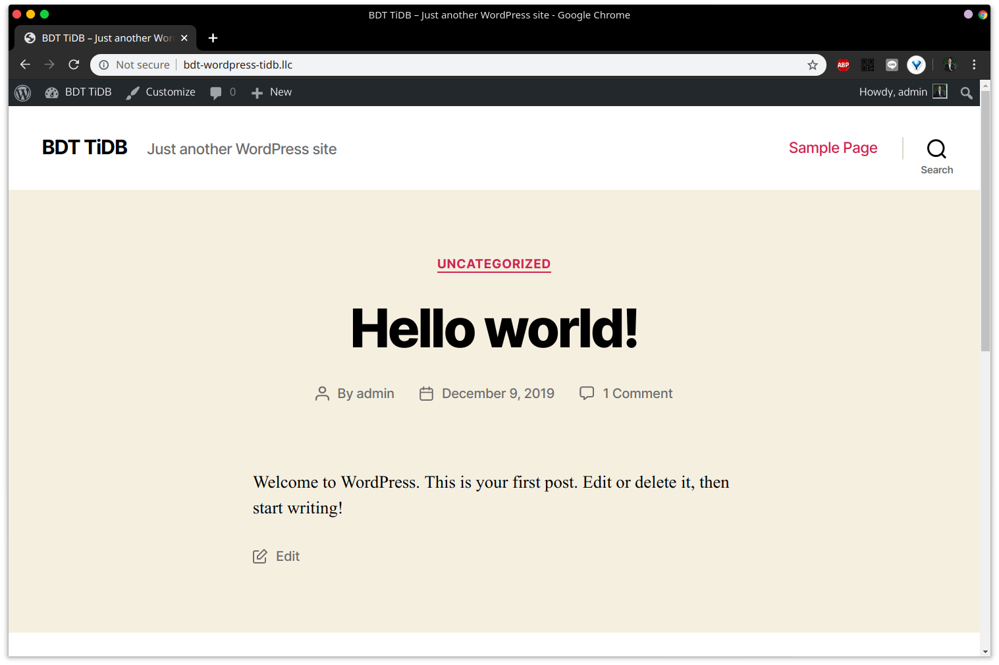
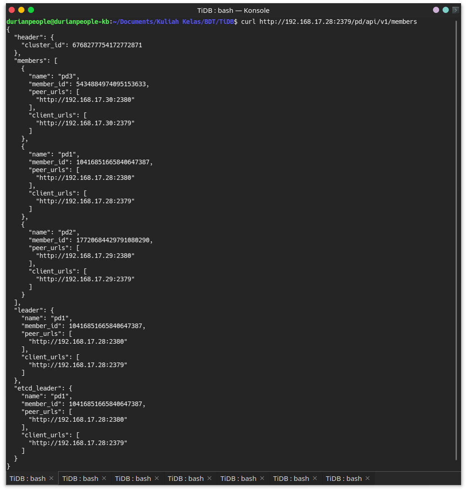
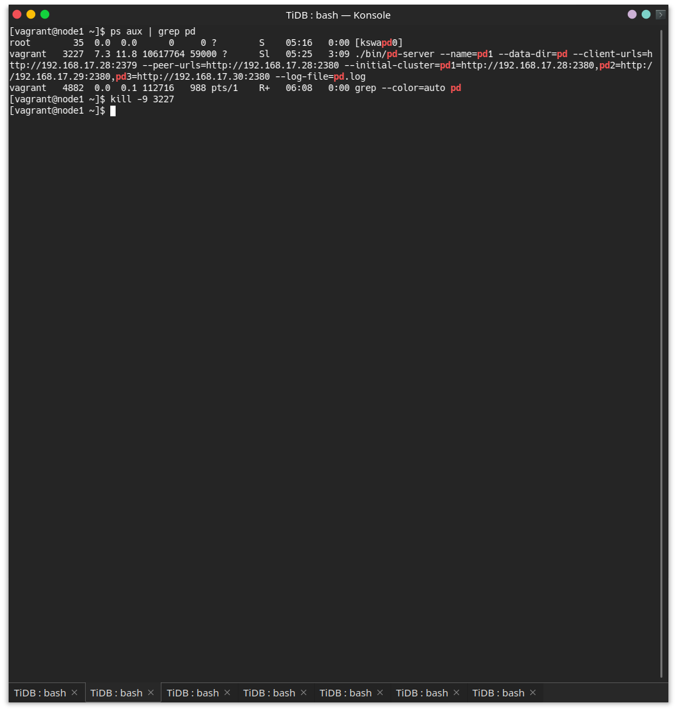
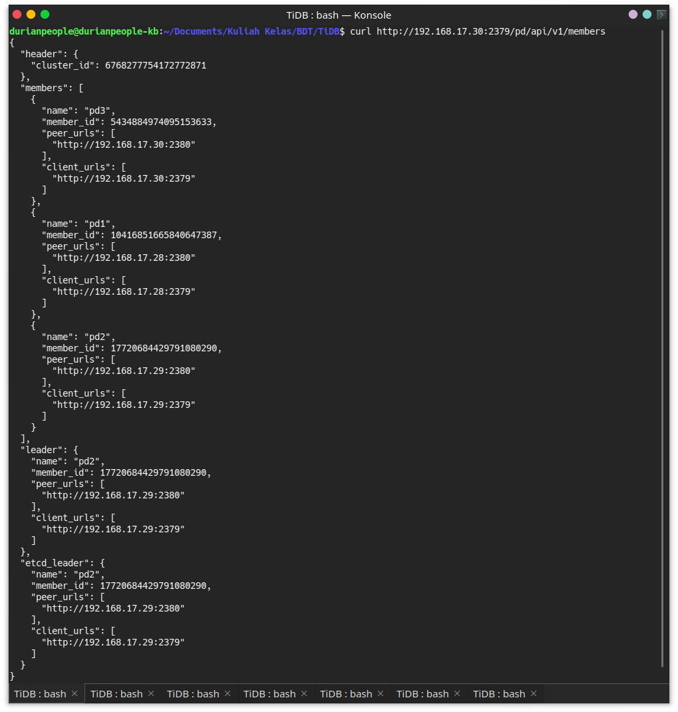
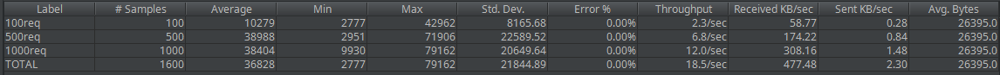
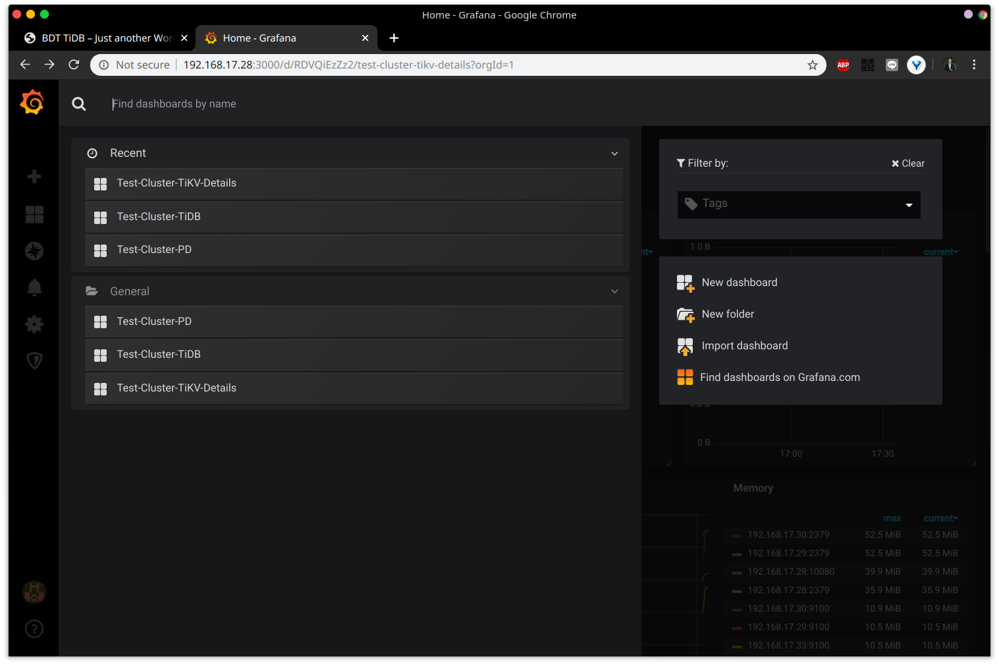
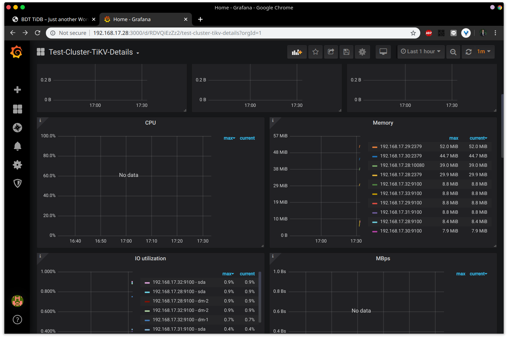

# Basis Data Terdistribusi -- TiDB

## Desain Arsitektur

Terdiri dari 6 node, dengan memori masing-masing 512MB dan menggunakan sistem operasi CentOS 7.

| Nama host | IP            | Instalasi                                    |
| --------- | ------------- | -------------------------------------------- |
| node1     | 192.168.17.28 | PD, TiDB, Node Exporter, Grafana, Prometheus |
| node2     | 192.168.17.29 | PD, Node Exporter                            |
| node3     | 192.168.17.30 | PD, Node Exporter                            |
| node4     | 192.168.17.31 | TiKV, Node Exporter                          |
| node5     | 192.168.17.32 | TiKV, Node Exporter                          |
| node6     | 192.168.17.33 | TiKV, Node Exporter                          |

Aplikasi yang digunakan untuk penggunaan database adalah Wordpress, yang dipasang di komputer host dengan spesifikasi:

- OS: Kubuntu 19.04
- RAM: 8GB

## Pengaturan Vagrant

Vagrant diatur agar sesuai dengan desain arsitrktur di atas dengan tambahan:

```
node.vbguest.auto_update = false
```

### PD, TiKV, dan TiDB

Jalankan perintah berikut untuk mengaktifkan PD server pada setiap node ke-*i* dengan i = [1,3]:

```bash
./bin/pd-server --name=pd[i] \
                --data-dir=pd \
                --client-urls="http://192.168.17.[27+i]:2379" \
                --peer-urls="http://192.168.17.[27+i]:2380" \
                --initial-cluster="pd1=http://192.168.17.28:2380,pd2=http://192.168.17.29:2380,pd3=http://192.168.17.30:2380" \
                --log-file=pd.log &          
```

Jalankan perintah berikut untuk mengaktifkan TiKV server pada setiap node ke-*i* dengan i = [4,6]:

```bash
cd tidb-v3.0-linux-amd64
./bin/tikv-server --pd="192.168.17.28:2379,192.168.17.29:2379,192.168.17.30:2379" \
                --addr="192.168.17.[30+i]:20160" \
                --data-dir=tikv \
                --log-file=tikv.log &
```

Setelah server PD dan TiKV sudah dijalankan, eksekusi perintah berikut pada node1 untuk menyalakan TiDB:

```bash
./bin/tidb-server --store=tikv \
                --path="192.168.17.28:2379" \
                --log-file=tidb.log &
```

## Penggunaan Aplikasi

Aplikasi yang digunakan pada project ini adalah Wordpress (standar, tanpa modifikasi). Pengaturan penting yang harus diganti dalam konfigurasi `wp-config.php` adalah sebagai berikut:

```php
/** The name of the database for WordPress */
define( 'DB_NAME', 'bdtwp' );

/** MySQL database username */
define( 'DB_USER', 'root' );

/** MySQL database password */
define( 'DB_PASSWORD', '' );

/** MySQL hostname */
define( 'DB_HOST', '192.168.17.28:4000' );
```

Setelah melakukan proses intalasi dengan mengisi form yang disediakan Wordpress, aplikasi sudah dapat digunakan.



## Benchmark

### Database

Uji performa database menggunakan Sysbench. Pemasangan dilakukan di node1 dengan perintah sebagai berikut:

```bash
curl -s https://packagecloud.io/install/repositories/akopytov/sysbench/script.rpm.sh | sudo bash
$ sudo yum -y install sysbench
```

Lalu download file konfigurasi dan aplikasi untuk pengujian TiDB:

```bash
git clone https://github.com/pingcap/tidb-bench.git
```

Ubah file `tidb-bench/sysbench/config` agar mengarah ke database TiDB.

Jalankan perintah berikut:

```bash
./run.sh point_select prepare 100
```

Tahapan berikut dilakukan tiga kali, untuk pengujian performa database dengan jumlah PD 1 hingga 3:

- Jalankan `./run.sh point_select run 100`
- Matikan salah satu PD

**Hasil benchmark database**:

- 1 PD:

  ```
  SQL statistics:
      queries performed:
          read:                            1729040
          write:                           0
          other:                           0
          total:                           1729040
      transactions:                        1729040 (5761.54 per sec.)
      queries:                             1729040 (5761.54 per sec.)
      ignored errors:                      0      (0.00 per sec.)
      reconnects:                          0      (0.00 per sec.)
  
  General statistics:
      total time:                          300.0983s
      total number of events:              1729040
  
  Latency (ms):
           min:                                    1.01
           avg:                                   17.35
           max:                                  100.90
           95th percentile:                       29.72
           sum:                             30003567.14
  
  Threads fairness:
      events (avg/stddev):           17290.4000/40.88
      execution time (avg/stddev):   300.0357/0.02
  ```

- 2 PD

  ```
  SQL statistics:
      queries performed:
          read:                            1838003
          write:                           0
          other:                           0
          total:                           1838003
      transactions:                        1838003 (6125.89 per sec.)
      queries:                             1838003 (6125.89 per sec.)
      ignored errors:                      0      (0.00 per sec.)
      reconnects:                          0      (0.00 per sec.)
  
  General statistics:
      total time:                          300.0363s
      total number of events:              1838003
  
  Latency (ms):
           min:                                    0.98
           avg:                                   16.32
           max:                                   82.81
           95th percentile:                       27.66
           sum:                             29997561.41
  
  Threads fairness:
      events (avg/stddev):           18380.0300/40.36
      execution time (avg/stddev):   299.9756/0.01
  ```

- 3 PD

  ```
  SQL statistics:
      queries performed:
          read:                            1803422
          write:                           0
          other:                           0
          total:                           1803422
      transactions:                        1803422 (6010.65 per sec.)
      queries:                             1803422 (6010.65 per sec.)
      ignored errors:                      0      (0.00 per sec.)
      reconnects:                          0      (0.00 per sec.)
  
  General statistics:
      total time:                          300.0357s
      total number of events:              1803422
  
  Latency (ms):
           min:                                    1.03
           avg:                                   16.63
           max:                                   84.91
           95th percentile:                       28.67
           sum:                             29994406.49
  
  Threads fairness:
      events (avg/stddev):           18034.2200/42.85
      execution time (avg/stddev):   299.9441/0.03
  ```

**Failover**:

Pada saat proses benchmarking, beberapa PD dimatikan. Berikut merupakan salah satu contoh failover, saat node1 dimatikan:



Leader masih berada pada node1. Berikut setelah mematikan service PD pada node1:





Leader pindah ke node2.

### Aplikasi

Pengujian dilakukan dengan JMeter dengan jumlah koneksi {100, 500, 1000}



## Monitoring

Jalankan node exporter di semua node dengan perintah berikut:

```bash
./node_exporter --web.listen-address=":9100" \
    --log.level="info" &
```

---

Install Prometheus pada node1:

```bash
wget https://github.com/prometheus/prometheus/releases/download/v2.2.1/prometheus-2.2.1.linux-amd64.tar.gz
tar -xzf prometheus-2.2.1.linux-amd64.tar.gz
```

Ganti konfigurasi file `prometheus.yml`:

```bash
cp /vagrant/prometheus/prometheus.yml ./prometheus.yml
```

Jalankan Prometheus:

```bash
./prometheus \
    --config.file="./prometheus.yml" \
    --web.listen-address=":9090" \
    --web.external-url="http://172.5.17.20:9090/" \
    --web.enable-admin-api \
    --log.level="info" \
    --storage.tsdb.path="./data.metrics" \
    --storage.tsdb.retention="15d" &
```

---

Install Grafana pada node1:

```bash
wget https://dl.grafana.com/oss/release/grafana-6.5.1.linux-amd64.tar.gz
tar -zxf grafana-6.5.1.linux-amd64.tar.gz
```

Tambahkan file konfigurasi `grafana.ini`

```bash
cp /vagrant/grafana/grafana.ini ./grafana.ini
```

Jalankan Grafana:

```bash
./bin/grafana-server \
    --config="./conf/grafana.ini" &
```

Buka Grafana di `http://192.168.17.28:3000`, login, kemudian tambahkan Prometheus sebagai data source.

Import dashboard Grafana dengan konfigurasi JSON yang ada di `grafana/*.json` pada repository ini.



